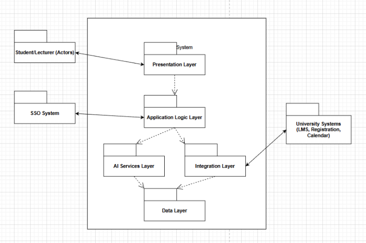
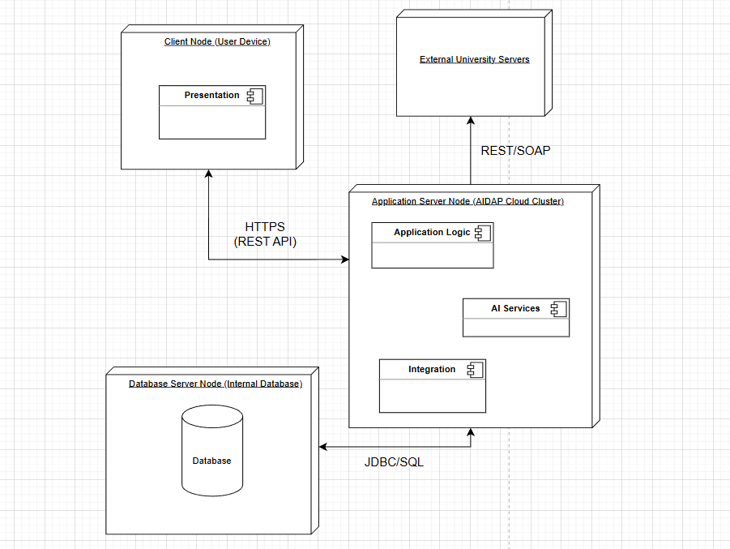

# Iteration 1: Establishing an Overall System Structure

## Step 1: Review Inputs
The purpose of Iteration 1 is to produce a high-level design structure for the AI-Powered Digital Assistant Platform (AIDAP). All use cases, quality attributes, constraints, and concerns were established in Phase 1.

**Design Purpose:** To create a modular, scalable architecture for a greenfield system which supports AI integration and external data connectivity.

**Primary Functional Requirements**:

- **UC-1 (Query Academic Information)**: Core function of the system involving AI interpretation and data retrieval to serve the users.
- **UC-2 (Manage Personal Academic Dashboard)**: Requires grouping of data from multiple sources for a personalized view for different user types.
- **UC-3 (Manage Course Content & Analytics)**: Involves lecturer authentication, letting the lecturer manage course materials, and data analytics processing for the lecturer use and analyze.

**Quality Attributes**:

- **QA-2 (Availability)**: 99.5% uptime requirement.
- **QA-3 (Scalability)**: Support for 5000 concurrent users.
- **QA-4 (Modifiability)**: Ease of integrating new AI models and external data sources to the system.

**Constraints**:
- **CON-1 (Integration)**: Must integrate with existing university systems.
- **CON-2 (Multi-platform Access)**: The system should be accessible using mobile, web, and voice assistants.
- **CON-4 (Cloud Deployment)**: The system needs to be a cloud-native service.
- **CON-7 (Standard APIs)**: Use REST or GraphQL for interoperability with external sources.
- **CON-9 (Data Retention)**: Store all the data about previous interactions with the system.

**Architectural Concerns**:
- **CRN-1 (Structure)**: Create an initial system structure supporting AI and connectivity.
- **CRN-2 (AI Frameworks)**: Choose technologies for NLP and AI.
- **CRN-5 (Integration)**: Designing an integration layer for data synchronization.

## Step 2: Establish Iteration Goal by Selecting Drivers

This is a greenfield system, so the goal for the first iteration is to address the architectural concern **CRN-1: Establishing an initial system structure**. It’s important to take into account key drivers that heavily influence the overall architecture, including:

- **CRN-1:** Overall system structure supporting AI and external connectivity  
- **CON-2:** Web, Mobile, Voice access support  
- **CON-4:** Cloud-based deployment  
- **QA-4:** Modifiability to allow integration of different models and external sources  

## Step 3: Choose One or More Elements of the System to Refine

We are creating a foundation and structure of the entire system so we are refining the entire AIDAP system. We are splitting the system into layers and subsystems.

## Step 4: Choose one or more design concepts that satisfy the selected architectural drivers

### Design Decisions and Location

| Design Decision | Rationale |
|-----------------|-----------|
| Logically structure the system using the Layered Architectural Pattern | The Layered Architectural Pattern provides a clear separation of concerns which is important for Modifiability (QA-4). It lets us isolate an AL Services Layer from Application Logic and Integration Layers. This structure also supports CRN-1 by clearly defining where the AI and External System Connectivity is placed. |
| Physically structure the application using an N-Tier Deployment Pattern | The N-Tier Deployment Pattern separates the Presentation, Application/Business, and Data tiers. This supports Cloud Deployment (CON-4) and prepares the system for Scalability (QA-3) by making the tiers independent of each other so changing one won’t affect the others. |
| Use a Single Page Application (SPA) client with REST APIs | Using a SPA client will cover Multi-platform access (CON-2). Also, a unified REST API (CON-7) lets web, mobile, and voice devices consume the same backend services without logic duplication. |

## Step 5: Instantiate Architectural Elements, Allocate Responsibilities, and Define Interfaces

### Elements and Responsibilities

| Element | Responsibility |
|---------|----------------|
| Presentation Layer | The Presentation Layer handles all user interactions, ensuring that it is able to handle interaction from each device type (web, mobile, voice) which handles CON-2. |
| Application Logic Layer | The Application Logic Layer controls the core business workflows so it will handle main functionalities (UC-1, UC-2, UC-3). Also manages user sessions and it handles all authentication using SSO. |
| AI Services Layer | The AI Services Layer is for Natural Language Processing (NLP) and analytic models. This layer covers CRN-2 and QA-4 because we have built the structure in a way to allow integration of different models. |
| Integration Layer | The Integration Layer deals with the communication with the external University Systems (LMS, Calendar, Registration DB). This layer covers CON-1 and CRN-5 because it handles the integration of systems. |
| Data Layer | The Data Layer holds all internal data using the internal relational database, this handles CON-9. |

## Step 6: Sketch Views and Record Design Decisions

### Diagram 1: Logical Architecture View (Layered)

### Diagram 2: Deployment View (Initial)

| Node/Element | Description | Rationale/Associated Driver |
|--------------|-------------|-----------------------------|
| Client Node | User Devices (Mobile, Web, Voice Assistant) hosting the Presentation logic. | CON-2: Supports multi-platform access using standard web protocols. |
| Application Server Node | Hosts the Application Logic, AI Services, and Integration modules. | CON-4: Cloud deployment allows for scaling. |
| Database Server Node | A dedicated server hosting the internal relational database. | CON-9: Ensures data retention policies and user history are stored securely and separately from logic. |
| External University Servers | Existing institutional systems that are external to the system boundary. | CON-1: The system must integrate with these sources using standard APIs. |
| HTTPS (REST API) | Communication protocol between the Client and Server. | CON-7: Uses standard interoperability protocols. |

## Step 7: Perform Analysis of Current Design and Review Iteration Goal and Achievement of Design Purpose

| Architectural Driver | Not Addressed | Partially Addressed | Completely Addressed | Rationale/Evaluation |
|---------------------|---------------|-------------------|--------------------|--------------------|
| CRN-1 |  |  | Yes | A Layered Architecture clearly defines the structure of the system |
| CON-2 (Access) |  |  | Yes | Separation of the Presentation Layer allows for all devices to connect to the system using APIs |
| CON-4 (Cloud) |  |  | Yes | The N-tier Deployment Pattern separates the different tiers which makes the system work well for cloud hosting |
| CON-7 (Standard APIs) |  |  | Yes | Using REST APIs handles interoperability |
| CON-9 (Data Retention) |  |  | Yes | The Data Layer and a physical Database Server hold all historical data |
| QA-4 Modifiability |  |  | Yes | The separation of layers supports modifiability, but still need to define specific adapters for external systems. |
| CON-1 (Integration) |  |  | Yes | The Integration Layer gives structure for connections but the specific adapters (LMS, Calendar) aren’t defined yet |
| UC-1, UC-2, UC-3 |  |  | Yes | The layers created the structure for the functions but the specific components and sequence interactions still need to be detailed |
| QA-2 (Availability) |  |  | Yes | The separation of parts of the system limits the impact of failure but still need to establish failure mechanisms |
| QA-3 (Scalability) |  |  | Yes | The N-tier pattern gives the ability to scale tiers independently but still need to design specific measures to account for it |
| CRN-2 (AI Frameworks) |  |  | Yes | The AI Services Layer creates space for these frameworks but still have not outlined specific technology choices |
| CRN-5 (Integration) |  |  | Yes | The Integration Layer has been planned but still need to add details for error handling, and data synchronization |
| All other drivers not covered yet |  |  | Yes | Covered in next Iterations |
