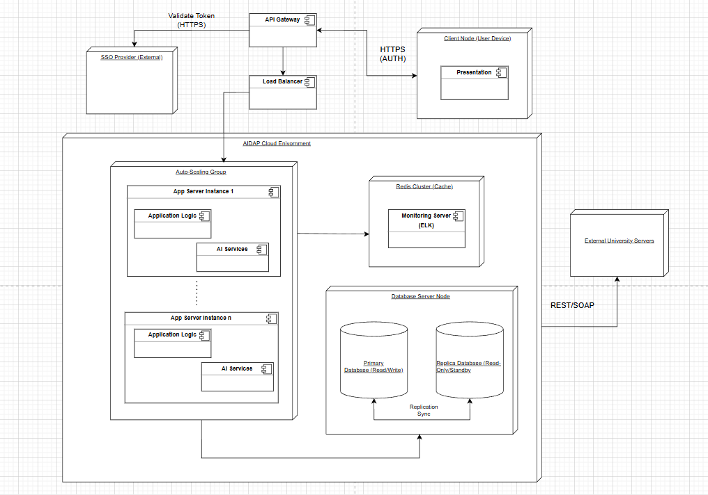

# Iteration 3: Addressing Quality Attribute Scenarios

| Team Member | Contribution |
|-------------|--------------|
| Armaan      | Completed (Sketch Views and Record Design Decisions) including the Refined Deployment Architecture diagram and Component Responsibilities table |
| Shagufta    | Completed Sequence Diagram for QA-5 (Security/SSO) as part of Step 6 and Completed Step 7 ATAM |
| Caren       | Completed Step 7 (ATAM Analysis) including risk assessment table, sensitivity points, and tradeoff analysis |

---
Building on the fundamental structural decisions made in Iterations 1 and 2, we can now add more details about the implementation of quality attributes related to robustness. This iteration shifts from functionality to quality. We specifically focused on three important quality attribute scenarios that we marked as not addressed or partially addressed previously.

---

## Step 2: Establish Iteration Goal by Selecting Drivers

**Iteration Goal:** For this iteration we focus on three quality attribute scenarios that have not been fully addressed. Want to refine the Physical Deployment Architecture to ensure that the system can handle a large number of current users, recover from failures, and enforce strict security boundaries:

**Selected Drivers for this Iteration:**

- **QA-3 (Scalability)** -  During peak registration, the system is able to handle up to 5000 users at once. All users get a response in adequate time without slowdown or degradation.
- **QA-2 (Availability)** - A component fails while the system is running, but everything keeps working. The system bounces back quickly and still hits the 99.5% uptime every month.
- **QA-5 (Security)** - Unauthorized access gets blocked, and logging of all attempts.

- **CON-5 (SSO)** - Must use single sign on
- **CON-8 (Capacity)** - Handles 5000 simultaneous users
- **CRN-6 (Zero Downtime)** - Continuous deployment and zero-downtime updates

- **UC-6 (Monitor Health)** - Maintainer needs visibility into system health including latency and errors

---

## Step 3: Choose One or More Elements of the System to Refine

The elements that will be refined are the physical nodes and logical access points identified in the previous iterations:

- **Application Server Node** – Needs to become a cluster
- **Database Server Node** – Needs redundancy
- **Network Boundary** – DNeeds a security gateway

---

## Step 4: Choose One or More Design Concepts That Satisfy the Selected Drivers

In this iteration, several design concepts are selected. The following table summarizes the design decisions:

| Design Decision | Rationale | Associated Driver |
|-----------------|-----------|-------------------|
| Introduce Load Balance Cluster Pattern | Handling 5000 users (QA-3, CON-8), one application server is a bottleneck. A load balancer distributed traffic across multiple stateless Server instances. This also supports CRN-6 (zero downtime) by allowing rolling updates (updating one node while others serve traffic). | QA-3, CON-8, CRN-6 |
| Introduce Active/Passive Database Replication | To ensure 99.5% uptime (QA-2), the database should not be a reason that the system fails. If the primary database fails, the copy of the database should take over immediately. | QA-2 |
| Introduce API Gateway with Security Filter Chain | To cover QA-5 and CON-5, an API gateway works as the only entry point. This enforces HTTPS, validates SSO token using the external SSO provider, and it logs access attempts before the request reaches the business logic. | QA-5, CON-5 |
| Introduce Centralized Loggins and Monitoring  | Satisfy UC-6 and QA-5 using logs from the Gateway, App Servers, and the database must be aggregated to a central dashboard for real-time analysis of health and security. | UC-6, QA-5 |

---

## Step 5: Instantiate Architectural Elements, Allocate Responsibilities, and Define Interfaces

| Design Decisions and Location | Rationale |
|-------------------------------|-----------|
| Deploy API Gateway as the single entry point | Deploying an API Gateway lets us offload SSL termination, rate limiting, and SSO token validation from the application servers. Thus simplifies the application logic and strengthens security boundaries (QA-5). |
| Deploy Application Servers in an Auto-Scaling Group | Application servers are stateless. By placing the application servers in an auto-scaling group behind the load balance, new instances can automatically spin up during peak registration (QA-3) and spin down during low traffic, this optimizes resource usage. |
| Deploy Database with a Copy/Replica | The primary database handles read and write operations. A synchronous copy/replica is maintained. If the primary fails, the system automatically changes to the copy (QA-2). |
| Use Redis for Session and Data Caching | Since the application servers are now stateless and replicated, user sessions and transient data need to be stored externally to ensure any server can hanle the next request, which is required for QA-3 (Scalability) and this also improves QA-1 (Performance). |
| Integrate Centralized Monitoring  | Using monitoring agents on every node ensures that logs and metrics are shipped to a central dashboard in real-time, which satisfies the maintainers need for visibility (UC-6) and security auditing (QA-5). |

---
## Step 6: Sketch Views and Record Design Decisions

### Diagram 1: Refined Deployment Architecture

| Element | Responsibility | Associated Drivers |
|---------|----------------|--------------------|
| Client Node | Initiates user requests (text, voice, web) from HTTPS and renders the UI. | CON-2 |
| SSO Provider (External) | Authenticates users and issues SSO tokens to ensure controlled access. | CON-5, QA-5 |
| External University Systems | Provides external data sources (LMS, Calendar, Registration DB) for the Integration Layer. | CON-1 |
| API Gateway | Acts as the single entry point. Enforces HTTPS, validates SSO tokens, performs rate limiting, and logs access attempts. | QA-5, CON-5 |
| Load Balancer | Evenly distributes client traffic from the API Gateway across all available Application Server nodes to handle load. | QA-3, CON-8 |
| Auto-Scaling Group | Manages the dynamic creation and deletion of Application Server nodes based on traffic load, managing system capacity (CON-8) and supporting rolling updates (CRN-6). | QA-3, CON-8, CRN-6 |
| Application Server nodes | Executes the business logic, and AI interpretation. They are stateless to enable clustering. | UC-1, UC-2, UC-3, QA-3 |
| Redis Cluster node | Stores external user sessions and caches frequently accessed data to support stateless App Servers and reduce latency. | QA-1, QA-3 |
| Primary DB | Handles all persistent data storage (user history, configurations) and all write operations. | CON-9, CRN-4 |
| Replica DB | Maintains a synchronous, identical copy of the Primary DB. Guarantees system Availability (99.5% uptime) via automatic failover. | QA-2 |
| Monitoring Server (ELK) | Centralizes, processes, and displays logs and metrics from all nodes for real-time health checks and security auditing. | UC-6, QA-5 |

### Diagram 2: Sequence Diagram for QA-5 (Security/SSO)

---
## Step 7 - Perform Analysis of Current Design and Review Iteration Goal and Achievement of Design Purpose 

| Architectural Driver | Not Addressed | Partially Addressed | Completely Addressed | Rational/Evaluation |
|----------------------|---------------|----------------------|-----------------------|----------------------|
| QA-3 (Scalability) |  |  | Yes | Load Balancer and Auto Scaling Group lets the system add servers dynamically to handle 5000+ users. |
| CON-8 (Capacity) |  |  | Yes | Handled by the scalable architecture refined above. |
| QA-2 (Availability) |  |  | Yes | Database replication and Multiple App Instances ensure there is no single point of failure. |
| QA-5 (Security) |  |  | Yes | API gateway, SSO integration, and Central logging. |
| CON-5 (SSO) |  |  | Yes | Modeled in the Security Sequence Diagram. |
| CRN-6 (Zero Downtime) |  |  | Yes | Architecture supports rolling updates for zero downtime. |
| UC-6 (Monitor Health) |  |  | Yes | Centralized logging and monitoring provides the dashboard needed by the maintainer. |

## ATAM Risk Assessment

### Risk Assessment Table

| Risk ID | Quality Attribute | Risk Description | Impact | Probability | Mitigation Strategy |
|---------|-------------------|------------------|--------|-------------|----------------------|
| **R1** | Availability | Single API Gateway becomes bottleneck or single point of failure | High | Medium | Deploy multiple API Gateway instances behind a DNS load balancer with health checks |
| **R2** | Scalability | Redis cluster failure causes session loss for all users | High | Low | Implement Redis Sentinel with automatic failover and session persistence to backup storage |
| **R3** | Security | SSO Provider downtime prevents all user access | High | Low | Implement graceful degradation with cached token validation and manual override for critical operations |
| **R4** | Performance | Database replication lag causes stale data reads | Medium | Medium | Monitor replication lag; route critical reads to primary; use eventual consistency patterns |
| **R5** | Availability | Auto-scaling takes too long during sudden traffic spikes | Medium | High | Pre-warm instances during predictable peak times; use faster instance startup mechanisms |
| **R6** | Monitoring | Log aggregation system failure loses critical security audit data | High | Low | Implement redundant logging pipelines; buffer logs locally with retry mechanisms |

---

# **Detailed Risk Analysis**

## **R1: API Gateway Single Point of Failure**

**Description:**
While the application servers scale horizontally, the API Gateway can become a bottleneck or a single point of failure if it becomes overloaded or crashes.

**Impact:**
Complete system unavailability; all user requests fail before reaching the backend.

**Sensitivity:**
System availability is highly dependent on API Gateway health.

**Mitigation:**

* Deploy multiple API Gateway instances across different availability zones
* Use DNS-based load balancing or a Network Load Balancer
* Implement health checks and automatic failover
* Monitor API Gateway performance metrics closely

---

## **R2: Redis Cluster Failure**

**Description:**
A failure in the Redis cluster results in all active user sessions being lost, forcing re-authentication and potential loss of temporary data.

**Impact:**
Poor user experience, potential temporary data loss, spike in authentication load.

**Sensitivity:**
Session availability is highly sensitive to Redis uptime.

**Mitigation:**

* Use Redis Sentinel for automatic failover and high availability
* Enable Redis persistence (AOF or RDB) for session recovery
* Consider backing up session data to secondary storage
* Implement session timeout warnings to reduce user disruption

---

## **R3: SSO Provider Downtime**

**Description:**
If the external SSO provider experiences downtime, users cannot authenticate, blocking system access.

**Impact:**
No new sessions can be started; partial service degradation for logged-in users.

**Sensitivity:**
System usability is fully dependent on SSO provider availability.

**Mitigation:**

* Cache recently validated tokens with short TTL
* Provide emergency access for critical administrators
* Proactively monitor SSO provider health
* Ensure SSO provider has a strong SLA (e.g., 99.5% uptime)

---

# **Sensitivity Points**

## **SP1: Auto-Scaling Threshold**

Small adjustments (e.g., CPU 70% → 80%) significantly change cost and performance.

**Tradeoff:**

* Lower threshold → better performance, higher cost
* Higher threshold → lower cost, risk of slower performance

---

## **SP2: Database Replication Synchronicity**

* **Synchronous:** Strong consistency, increased write latency
* **Asynchronous:** Lower latency, risk of data loss during failover

**Tradeoff:** Data consistency vs. write performance

---

## **SP3: Session Cache TTL**

* **Short TTL:** More secure, but frequent authentication
* **Long TTL:** Better UX, but increased security risk

**Tradeoff:** Security vs. convenience

---

# **Architectural Tradeoffs**

## **T1: Stateless Application Servers vs. Complexity**

**Decision:** Use stateless app servers with Redis for session storage
**Rationale:** Enables horizontal scaling and easier load balancing
**Impact:** Higher infrastructure complexity; dependency on Redis
**Benefit:**

* Scale to 5000+ users
* Rolling updates without session loss

---

## **T2: Active/Passive Database Replication vs. Cost**

**Decision:** Use primary–replica replication
**Rationale:** Simple, reliable, meets 99.5% availability
**Impact:** Replica is idle except during failover
**Benefit:** Lower cost, easier consistency model

---

## **T3: Centralized Logging vs. Performance**

**Decision:** Route all logs to ELK stack
**Rationale:** Needed for security audits and monitoring
**Impact:** Added network overhead; dependency on logging infrastructure
**Benefit:** Complete visibility for debugging and compliance

---

## **T4: API Gateway Overhead vs. Security**

**Decision:** All traffic flows through the API Gateway
**Rationale:** Centralized security, SSO validation, rate limiting
**Impact:** Extra network hop adds ~10–20 ms latency
**Benefit:** Consistent enforcement and simplified app logic

---
## ** Utility Tree **

